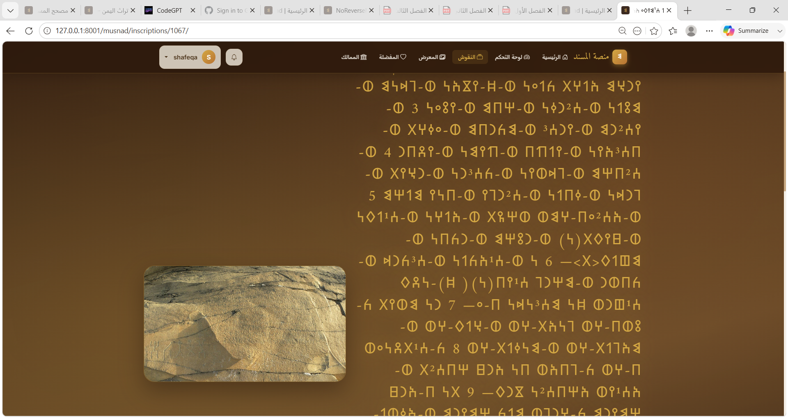
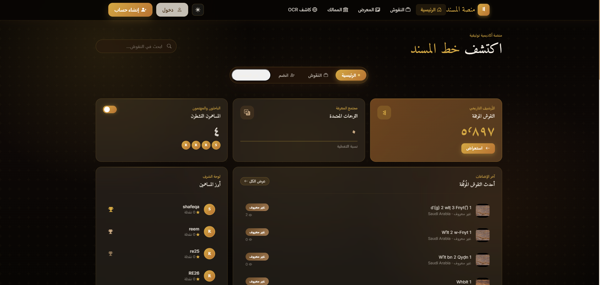
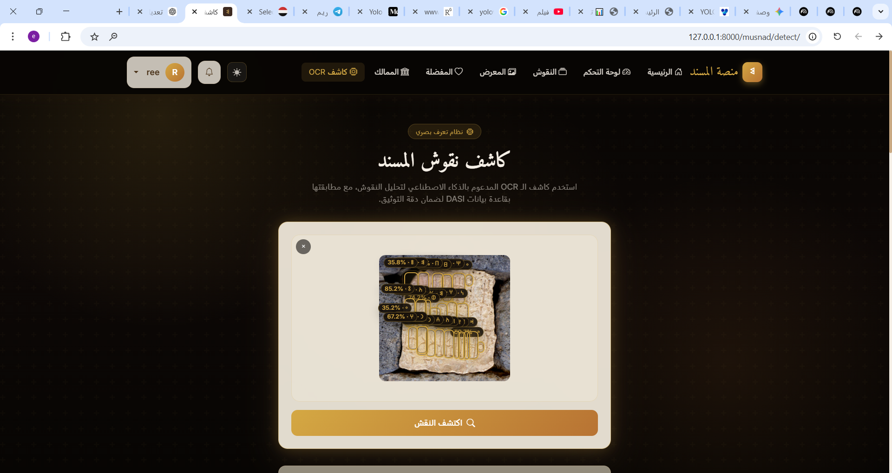

<div align="center">
  
  <h1>منصة خط المسند | Musnad Platform</h1>
  <p><b>منصة أكاديمية ومجتمعية لتوثيق وترجمة النقوش العربية الجنوبية القديمة (خط المسند).</b></p>
</div>

<br>

## 🌟 عن المشروع (About The Project)
**منصة خط المسند** هي تطبيق ويب متكامل مبني باستخدام **Django** يهدف إلى الحفاظ على التراث اليمني القديم وتوثيقه. تقدم المنصة أرشيفاً رقمياً للباحثين والمهتمين بنقوش الممالك اليمنية القديمة (سبأ، معين، حمير، قتبان وغيرها)، وتتيح للمجتمع المشاركة في ترجمة هذه النقوش وتحليلها من خلال بيئة تفاعلية ومحفزة.


## ✨ المميزات الأساسية (Key Features)

- 🏛️ **مشهد الممالك التفاعلي (Interactive Kingdoms):** مقارنة بصرية ثلاثية الأبعاد (3D) للممالك اليمنية باستخدام `Three.js` مع بطاقات معلومات غنية.
- 🔍 **كاشف النقوش الذكي (AI OCR Detection):** نظام مدمج يعتمد على تقنيات الذكاء الاصطناعي (YOLO & PyTorch) للتعرف البصري على حروف خط المسند من الصور المرفوعة.
- 📝 **الترجمة التشاركية (Crowdsourced Translations):** نظام يسمح للمستخدمين بإضافة ترجمات للنقوش مع دعم التصويت (Voting)، المراجعة (Reviewing)، والاعتماد (Approval).
- 💬 **مجتمع المعرفة (Community Threads):** مساحات نقاش وتعليقات مرتبطة بكل نقش لتعزيز التفاعل الأكاديمي.
- 🏆 **نظام السمعة (Reputation & Badges):** نظام تحفيزي يمنح المستخدمين نقاط وشارات عند إضافة نقوش أو ترجمات معتمدة.
- 🔔 **نظام الإشعارات (Notifications):** إشعارات لحظية للمستخدمين عند الموافقة على مساهماتهم أو التفاعل معها.
- 🎨 **تصميم حديث وعصري (Modern UI):** واجهات زجاجية (Glassmorphism) تدعم الوضعين الليلي والنهاري (Dark/Light Mode) مبنية على `Bootstrap 5 RTL` و `HTMX` لتجربة مستخدم سلسة بدون إعادة تحميل.

## 📸 لقطات الشاشة (Screenshots)

<div align="center">
  
  
</div>
<br>
<div align="center">
  
</div>

## 🛠️ التقنيات المستخدمة (Tech Stack)

### 🔹 الواجهة الخلفية (Backend)
- **Framework:** Django 5.2 & Django REST Framework (DRF)
- **Database:** PostgreSQL / SQLite
- **AI/ML:** PyTorch, Ultralytics YOLO, OpenCV

### 🔹 الواجهة الأمامية (Frontend)
- **Templates:** Django HTML Templates + HTMX
- **Styling:** CSS3 Variables (Custom Properties), Bootstrap 5 (RTL)
- **Scripting:** Vanilla JavaScript, Alpine.js, Three.js, GSAP

## 🚀 كيفية التشغيل (Installation & Setup)

1. **استنساخ المشروع (Clone the repo):**
   ```bash
   git clone https://github.com/username/musnad-platform.git
   cd musnad-platform
   ```

2. **إنشاء البيئة الوهمية وتفعيلها (Virtual Environment):**
   ```bash
   python -m venv venv
   source venv/bin/activate  # On Windows: venv\Scripts\activate
   ```

3. **تثبيت الحزم المطلوبة (Install Requirements):**
   ```bash
   pip install -r requirements.txt
   ```

4. **إعداد متغيرات البيئة (Environment Variables):**
   انسخ ملف `.env.example` وقم بتسميته `.env` وعدل المتغيرات داخله حسب الحاجة.

5. **تطبيق قواعد البيانات وإنشاء مستخدم خارق (Migrations & Superuser):**
   ```bash
   python manage.py migrate
   python manage.py createsuperuser
   ```

6. **تشغيل الخادم المحلي (Run Server):**
   ```bash
   python manage.py runserver
   ```
   يمكنك الآن تصفح الموقع عبر الرابط: `http://127.0.0.1:8000/musnad/`

## 📂 هيكلية المشروع الأساسية (Project Structure)
- `inscriptions/`: إدارة النقوش الأساسية وسير عمل المراجعة.
- `accounts/`: إدارة المستخدمين والملفات الشخصية.
- `translations/`: سير عمل الترجمات والتصويت.
- `frontend/`: موجهات الواجهة الأمامية (Views) والـ Forms.
- `templates/`: قوالب HTML مرتبة بأسلوب هندسي ممتاز مع HTMX.
- `community/`: إدارة النقاشات والتعليقات.

## 🤝 المساهمة (Contributing)
نرحب بجميع المساهمات! لعمل أي تعديلات:
1. قم بعمل Fork للمستودع.
2. أنشئ Branch جديد (`git checkout -b feature/AmazingFeature`).
3. أضف تعديلاتك وقم بعمل Commit (`git commit -m 'Add some AmazingFeature'`).
4. ارفع التعديلات (`git push origin feature/AmazingFeature`).
5. افتح Pull Request.

## 📜 الترخيص (License)
جميع الحقوق محفوظة - مشروع منصة خط المسند © 2026.
تطوير: **م. ريم الوائل**
