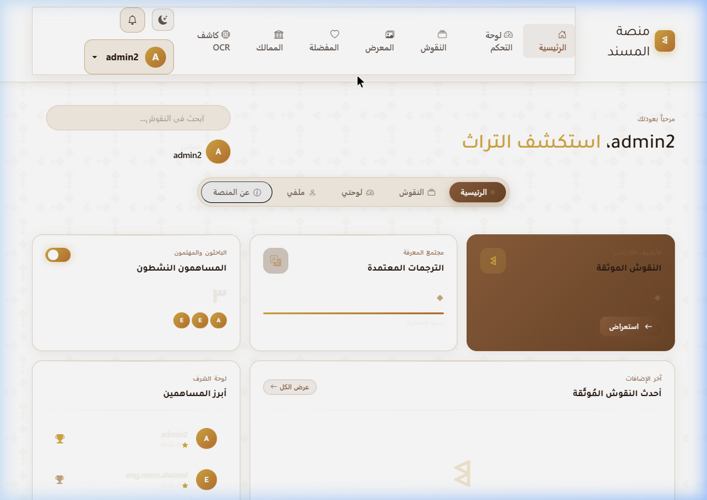
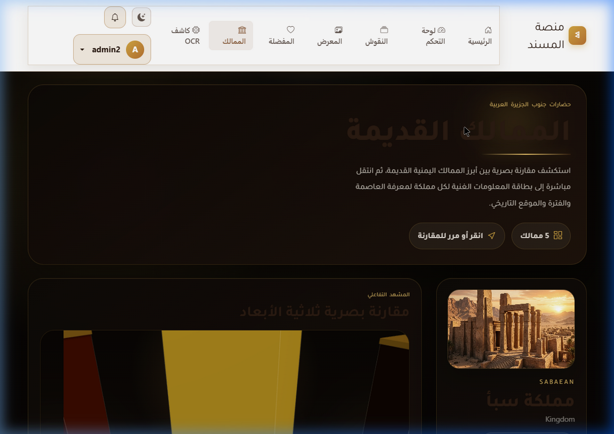
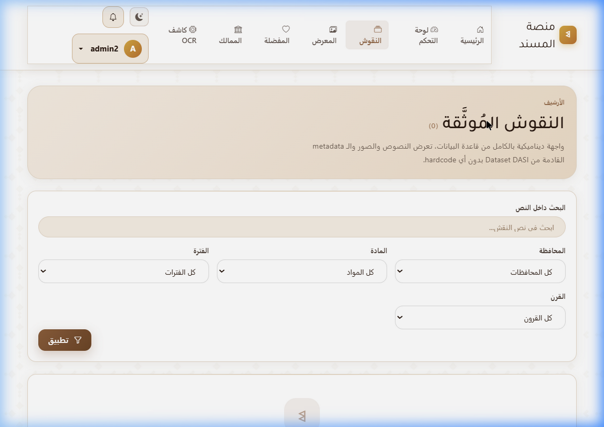
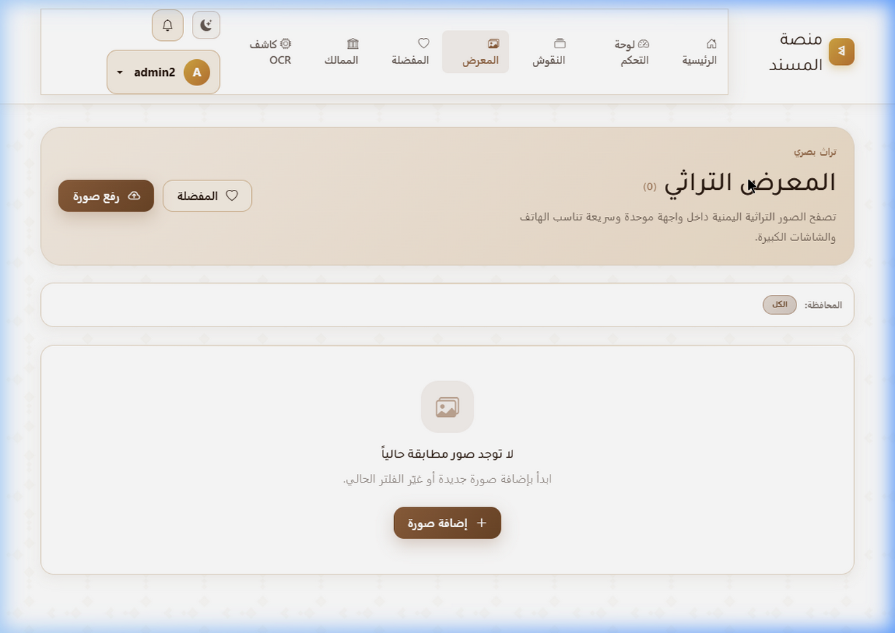
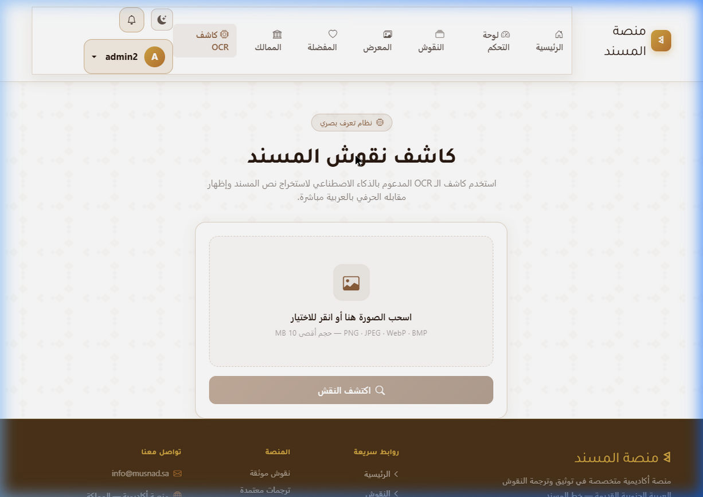
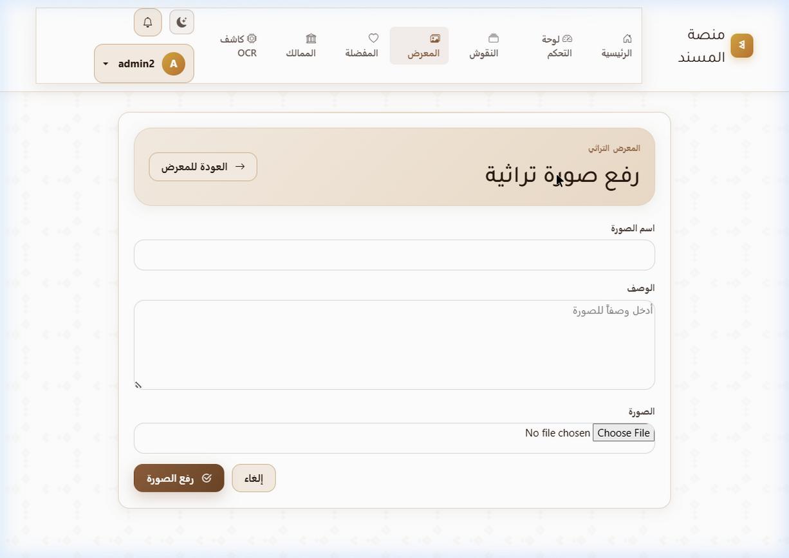
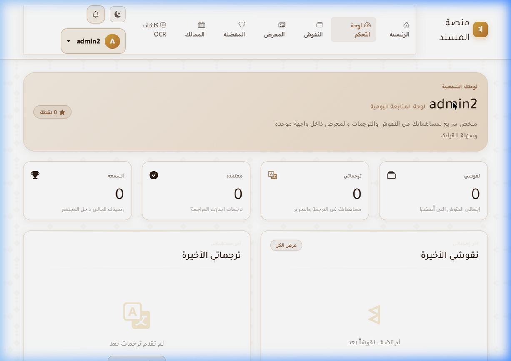
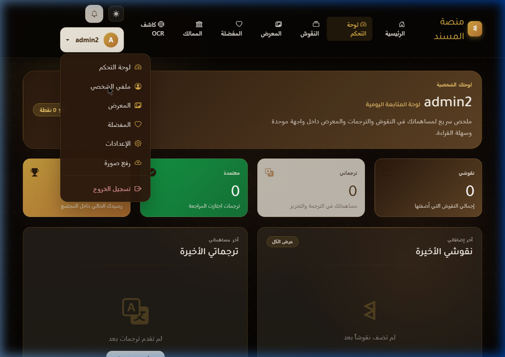
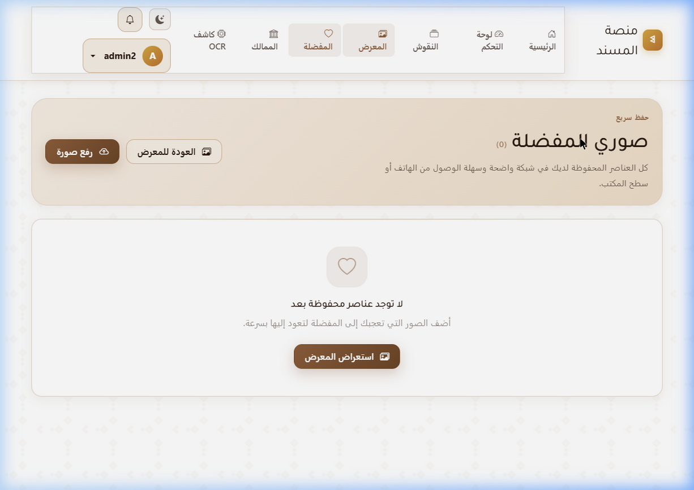
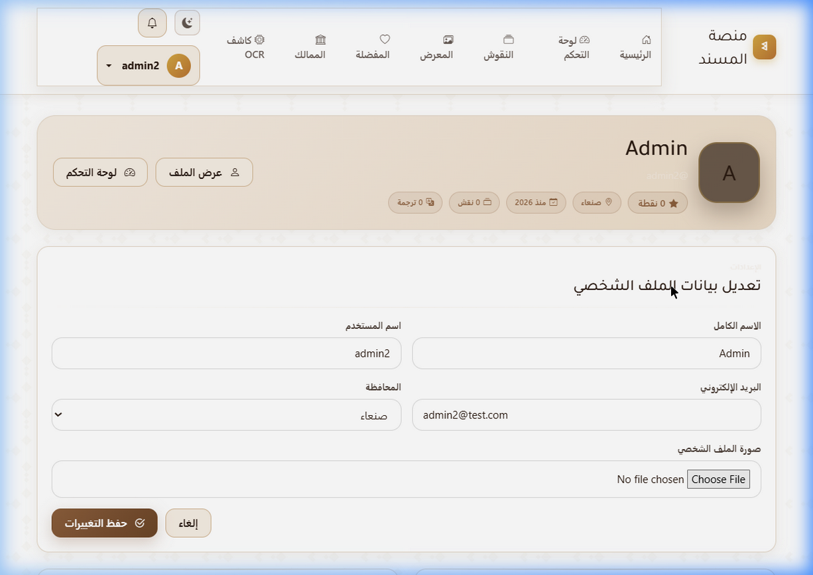

  
  <h1>🏛️ منصة مُسند للتراث اليمني | Musnad Platform</h1>
  
  
<b>أرشيف رقمي ذكي لإحياء التراث اليمني العريق بقوة الذكاء الاصطناعي وهندسة البرمجيات الحديثة.</b>

  <!-- Badges -->
  

    
    
    
    
    
  

 

## 🌟 عن المشروع (About The Project)

**منصة خط المسند** ليست مجرد موقع إلكتروني، بل هي **جسر تقني يربط بين حضارات اليمن القديمة وتكنولوجيا المستقبل**. 
تم بناء هذا النظام المعقد من الصفر ليكون المرجع الأول للباحثين والمهتمين بالنقوش اليمنية والممالك القديمة (سبأ، حمير، أوسان، قتبان، حضرموت، ومعين). 

يجمع المشروع بين **تطوير الويب المتقدم (Django)**، **الذكاء الاصطناعي (Computer Vision)**، و**البيئات السحابية (Docker)** لتقديم تجربة مستخدم لا مثيل لها، تتيح للزوار ترجمة النقوش والمساهمة في حفظ التاريخ.

---

## ✨ الخصائص التقنية والمميزات (Core Features)

### 🧠 1. الذكاء الاصطناعي وكاشف المسند (AI OCR Detection)
- نظام مدمج يعتمد على تقنيات الذكاء الاصطناعي للتعرف البصري على حروف المسند من الصور المرفوعة مباشرة.
- تحويل الصور إلى نصوص رقمية لتسهيل الترجمة والبحث.

### 👥 2. مجتمع المعرفة والترجمة التشاركية (Crowdsourced Translations)
- منصة تفاعلية تتيح للمستخدمين إضافة ترجماتهم للنقوش.
- نظام **تصويت (Voting)** و**مراجعة (Reviewing)** يعتمد على المجتمع لاختيار الترجمات الأدق.

### 🏆 3. نظام السمعة والمكافآت (Reputation System)
- نظام تحفيزي ذكي يمنح المستخدمين نقاطاً وشارات (Badges) عند الموافقة على مساهماتهم (نقوش أو ترجمات).
- لوحة تحكم (Dashboard) تبرز إنجازات الباحث وتصنيفه.

### 🎨 4. تجربة مستخدم مذهلة (UI/UX & HTMX)
- واجهات متجاوبة كلياً مبنية بلمسة تراثية أصيلة.
- تصفح ديناميكي بدون إعادة تحميل الصفحة بفضل تقنية **HTMX**.
- معرض صور (Masonry Grid) يستعرض تفاصيل النقوش بدقة عالية.

### 🐳 5. بيئة عمل معيارية (Dockerized Environment)
- المشروع مغلف بالكامل باستخدام Docker و Docker Compose لضمان استقرار الخوادم وسهولة التشغيل في بيئة الإنتاج أو التطوير بضغطة زر.

---

## 🛠️ التقنيات المستخدمة (Tech Stack)

| المجال | التقنيات |
| :--- | :--- |
| **الواجهة الخلفية (Backend)** | Django 5, Python 3.11, Django REST Framework |
| **الواجهة الأمامية (Frontend)** | HTML5, CSS3, Vanilla JS, Bootstrap 5 RTL, HTMX |
| **الذكاء الاصطناعي (AI/ML)** | PyTorch, Ultralytics YOLO, OpenCV |
| **قواعد البيانات (Database)** | PostgreSQL (Production), SQLite (Dev) |
| **النشر والتشغيل (DevOps)** | Docker, Docker Compose |

---

## 📂 هيكلية التطبيقات (Django Apps Architecture)

تم تقسيم المشروع إلى تطبيقات (Apps) مصغرة لضمان سهولة الصيانة وقابلية التوسع (Scalability):
- `core/`: الإعدادات الأساسية، والصلاحيات، والـ Middleware.
- `accounts/`: نظام المصادقة المخصص وإدارة الملفات الشخصية.
- `inscriptions/`: الأرشيف الأساسي للنقوش، الممالك، والمقاطعات.
- `translations/`: محرك الترجمة، التقييم، والتصويت.
- `community/`: إدارة التفاعل والمناقشات حول النقوش.
- `reputation/`: محرك النقاط والمكافآت للمستخدمين النشطين.
- `frontend/`: إدارة واجهات العرض (Views) والقوالب (Templates).

---

## 📸 جولة تفصيلية داخل المنصة (Platform Showcase)

تتميز المنصة بتصميم نهاري/ليلي متجاوب يعكس الأصالة اليمنية. إليك نظرة مفصلة على أبرز أقسام المنصة:

### 1️⃣ الواجهة الرئيسية والممالك القديمة (Home & Kingdoms)
بوابة الدخول للتاريخ اليمني، حيث تستعرض الواجهة الرئيسية إحصائيات النظام الحية (أكثر من 5800 نقش موثق). كما يتيح لك قسم الممالك القديمة استكشاف (سبأ، حمير، قتبان...) عبر بطاقات معلومات تفصيلية مبهرة.

  
  

### 2️⃣ مكتبة النقوش والمعرض التراثي (Inscriptions & Gallery)
أرشيف رقمي ضخم يسمح بالبحث المتقدم في النقوش، واستعراض تفاصيلها التاريخية مع إظهار النص الأصلي المحفور بخط المسند الذهبي، بالإضافة لمعرض صور شبكي انسيابي.

  
  

### 3️⃣ الذكاء الاصطناعي ورفع النقوش (AI OCR & Upload)
أداة متطورة تسمح للباحثين برفع صور لأي حجر أثري، ليقوم نظام الذكاء الاصطناعي بالتعرف البصري على الحروف المسندية وتحديد أماكنها بدقة (Bounding Boxes)، مع إمكانية مساهمة الباحث برفع وتوثيق نقوش جديدة.

  
  

### 4️⃣ لوحة التحكم والملف الشخصي (Dashboard & Profile)
مساحة مخصصة لكل مستخدم وباحث تعرض إحصائياته الخاصة، مستواه، والنقوش التي ساهم في ترجمتها، مما يعزز نظام التفاعل الأكاديمي والسمعة داخل المنصة.

  
  

### 5️⃣ المفضلة وإعدادات الحساب (Favorites & Settings)
نظام مرن لحفظ النقوش للرجوع إليها سريعاً أثناء البحث العلمي، مع واجهة إعدادات شاملة تتيح للمستخدم تخصيص تجربته، إدارة الخصوصية، وتحديث بياناته.

  
  

---

## 🤝 فريق العمل (The Team)
تم تصميم وتطوير المنصة كجهد أكاديمي هندسي مشترك:
- **تطوير وهندسة:** 
  - [ م. ريم الوعيل](https://github.com/re6-25)
  - [م. الزهراء الصباحي](https://github.com/zahraa-khalid2)
- **إشراف:** د. أكرم الصباري
- **مساعد مشرف:** [م. قسورة المحمدي](https://github.com/KASSWRH)

© 2026 جميع الحقوق محفوظة لـ منصة خط المسند.
