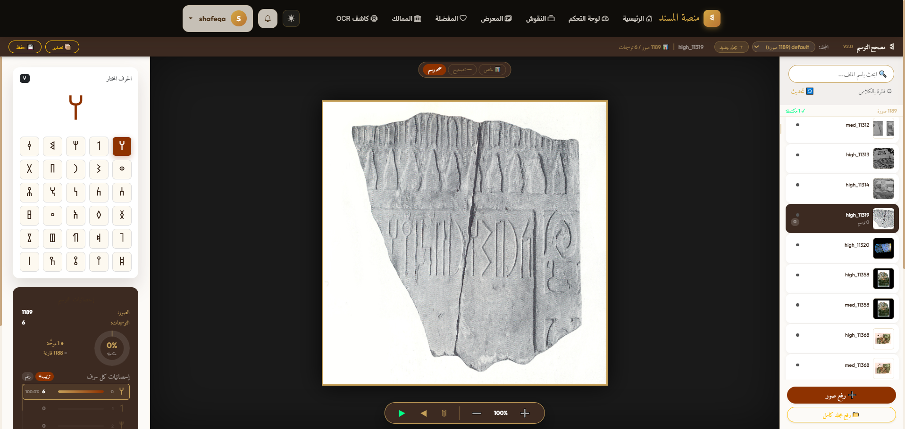

  
  <h1>منصة خط المسند | Musnad Platform</h1>
  
<b>منصة أكاديمية ومجتمعية متكاملة لتوثيق، ترجمة، واكتشاف النقوش العربية الجنوبية القديمة (خط المسند).</b>

 

## 🌟 عن المشروع (About The Project)
تهدف **منصة خط المسند** إلى حفظ التراث اليمني القديم في أرشيف رقمي ضخم. تم بناء النظام بتصميم عصري وأنيق (Dark Mode) مستوحى من ألوان التراث، ويوفر بيئة للباحثين والمهتمين لاكتشاف الممالك القديمة، والمساهمة في الترجمات، وتوثيق الآثار، بل وحتى استخدام أدوات الذكاء الاصطناعي لقراءة النقوش من الصور مباشرة.

---

## 📸 جولة داخل المنصة (Platform Showcase)

### 1️⃣ لوحة التحكم الرئيسية والإحصائيات (Dashboard & Home)
الواجهة الرئيسية تعرض إحصائيات النظام الحية، مثل عدد النقوش الموثقة (أكثر من 5800 نقش)، وأحدث الإضافات، بالإضافة إلى أزرار للوصول السريع إلى أقسام المنصة.

  

### 2️⃣ نظام التعرف البصري بالذكاء الاصطناعي (AI OCR Detector)
أداة متطورة تسمح برفع صورة لأي حجر أثري، ليقوم نظام الذكاء الاصطناعي بالتعرف على الحروف المسندية، وتحديد أماكنها بدقة (Bounding Boxes) مع عرض نسبة الثقة لكل حرف.

  

### 3️⃣ استعراض تفاصيل النقوش (Inscription Details)
عرض أنيق للبيانات التاريخية، حيث تظهر صورة الحجر الأصلي بجانب النص الكامل المحفور عليه مكتوباً بخط المسند الذهبي المتوهج، ليتسنى للباحثين المقارنة والترجمة.

  

### 4️⃣ مصحح التوسيم الاحترافي (Label Corrector)
أداة مساعدة مخصصة لفريق العمل الأكاديمي، تسمح باختيار الحروف المسندية من لوحة مفاتيح مخصصة وتحديد إحداثياتها على الصورة الأصلية، لتدريب وتحسين دقة نماذج الذكاء الاصطناعي.

  

---

## ✨ المميزات البرمجية والتفاعلية (Key Features)

- 🏛️ **مشهد الممالك التفاعلي:** مقارنة بصرية للممالك اليمنية (سبأ، حمير، قتبان...) مع بطاقات معلومات تفصيلية.
- 📝 **الترجمة التشاركية (Crowdsourced):** مساحة للباحثين لتقديم ترجمات للنقوش مع آلية للتصويت والمراجعة من قبل المختصين.
- 💬 **مجتمع المعرفة (Community):** نظام تعليقات ونقاشات مدمج تحت كل نقش.
- 🏆 **نظام السمعة (Gamification):** مكافأة المستخدمين النشطين بنقاط وشارات (Badges) عند اعتماد مساهماتهم.

## 🛠️ التقنيات المستخدمة (Tech Stack)

- **الواجهة الخلفية (Backend):** Django 5.2, Django REST Framework (DRF), PostgreSQL / SQLite.
- **الذكاء الاصطناعي (AI):** Ultralytics YOLO, PyTorch, OpenCV للتعرف البصري (OCR).
- **الواجهة الأمامية (Frontend):** 
  - Django Templates مدعومة بتقنية **HTMX** لتحديث الصفحات بدون إعادة تحميل (SPA-like experience).
  - تصميم متجاوب يعتمد على **Bootstrap 5 RTL** ومتغيرات CSS الحديثة (CSS3 Variables).
  - تأثيرات الزجاج (Glassmorphism) وتصميم متقن لواجهة المستخدم (UI/UX).
  - مكتبات مساعدة مثل `Alpine.js` للتفاعلات، و `Three.js / GSAP` للمشاهد ثلاثية الأبعاد.

## 🤝 فريق التطوير
تم التصميم والتطوير بواسطة: **م. ريم الوائل**
© 2026 جميع الحقوق محفوظة لـ منصة خط المسند.
